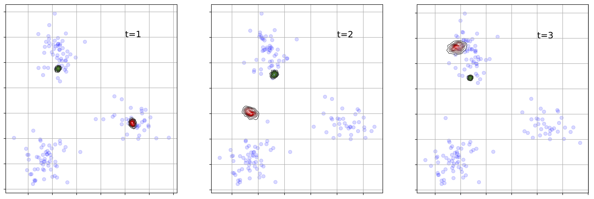

Variational Graph Recurrent Neural Networks
============

This is a PyTorch implementation of the VGRNN model as described in our paper:

E. Hajiramezanali*, A. Hasanzadeh*, N. Duffield, K. R. Narayanan, M. Zhou, and X. Qian, [Variational Graph Recurrent Neural Networks](http://papers.nips.cc/paper/9254-variational-graph-recurrent-neural-networks), Advances in Neural Information Processing Systems (NeurIPS), 2019, *equal contribution


**Abstract:** Representation learning over graph structured data has been mostly studied in static graph settings while efforts for modeling dynamic graphs are still scant. In this paper, we develop a novel hierarchical variational model that introduces additional latent random variables to jointly model the hidden states of a graph recurrent neural network (GRNN) to capture both topology and node attribute changes in dynamic graphs. We argue that the use of high-level latent random variables in this variational GRNN (VGRNN) can better capture potential variability observed in dynamic graphs as well as the uncertainty of node latent representation. With semi-implicit variational inference developed for this new VGRNN architecture (SI-VGRNN), we show that flexible non-Gaussian latent representations can further help dynamic graph analytic tasks. Our experiments with multiple real-world dynamic graph datasets demonstrate that SI-VGRNN and VGRNN consistently outperform the existing baseline and state-of-the-art methods by a significant margin in dynamic link prediction. 

**Example:** VGRNN learns interpretable latent representations.




## Requirements
```
CUDA==9.0.176
Python==2.7.12
networkx==2.2
scipy==1.1.0
torch==1.0.0      
torch-cluster==1.2.3      
torch-geometric==1.0.2      
torch-scatter==1.1.1      
torch-sparse==0.2.3      
torch-spline-conv==1.0.5      
torchvision==0.2.1
```

## Cite

Please cite our paper if you use this code in your own work:

```
@inproceedings{hajiramezanali2019variational,
  title={Variational graph recurrent neural networks},
  author={Hajiramezanali, Ehsan and Hasanzadeh, Arman and Narayanan, Krishna and Duffield, Nick and Zhou, Mingyuan and Qian, Xiaoning},
  booktitle={Advances in Neural Information Processing Systems},
  pages={10700--10710},
  year={2019}
}
```

Please direct your inquiries to armanihm@tamu.edu or ehsanr@tamu.edu .
